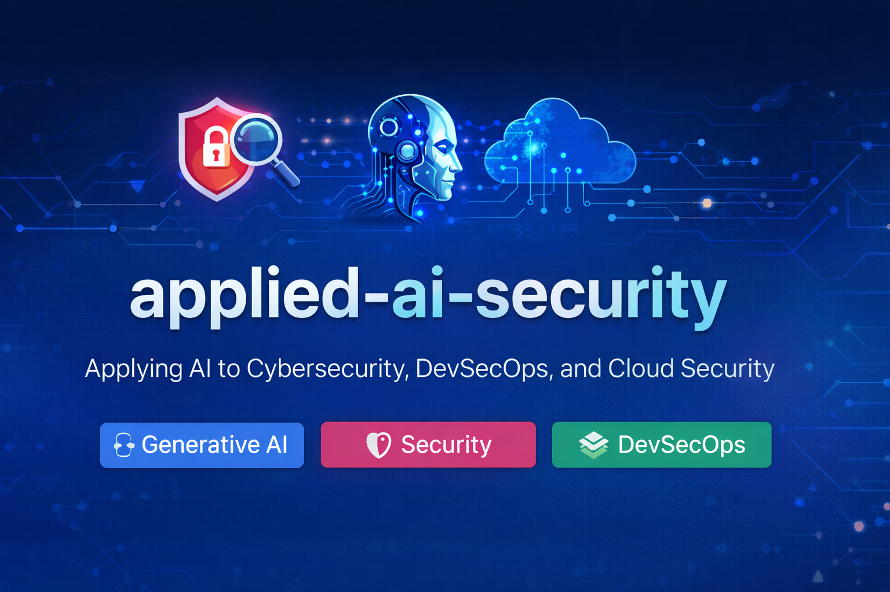

This repository is my personal learning and experimentation space where I focus on **applying AI to real-world cybersecurity, DevSecOps, and cloud security problems**.

My approach is simple:  
**learn the fundamentals, build small practical solutions, and document the outcomes clearly.**

---

## 📂 How This Repo Is Organized  

I follow a 3-part structure to keep learning, building, and presentation clearly separated.

### 🔍 xplore  
Learning material – notes, PDFs, and references related to:
- DevOps (Terraform, CI/CD, Cloud)  
- Cybersecurity (Vulnerability Management, AppSec, Threat Modeling)  
- Generative AI (LLMs, RAG, embeddings, API integrations)  

---

### 🧪 xperiment  
Hands-on projects and POCs that combine:
- Security fundamentals  
- DevOps automation  
- AI enhancements  

---

### 📤 xtract  
Presentation layer:
- Project READMEs  
- Architecture diagrams  
- Demo screenshots  
- Key learnings  

---

## 👤 About Me  

I build secure, cloud-native GenAI POCs that help teams decide faster.

My background includes **DevOps, platform engineering, and security**, with a strong interest in integrating **Generative AI** into existing systems in a reliable and responsible way.

This repository reflects my hands-on, structured approach to applied AI with a strong emphasis on **practical impact and security awareness**.
